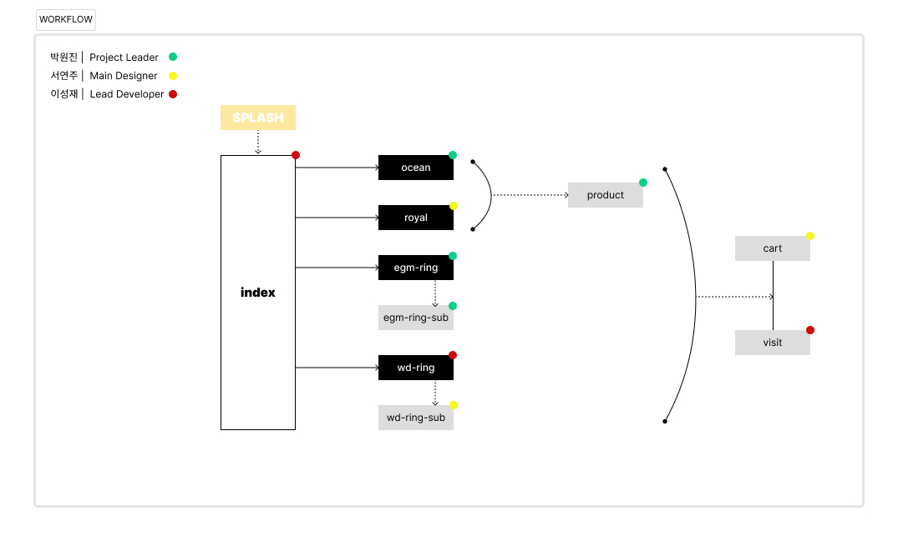

# **💎Lazuli**

하이엔드 주얼리 브랜드  
_'해리윈스턴'_ 웹사이트를 참조하여,  
가상의 브랜드 _'Lazuli'_ 를 대표하는 웹사이트로  
재구성한 포트폴리오를 소개하고자 합니다😀

### 1️⃣ Web page

> **[Main Page](https://eehd80.github.io/lazuli/)**

### 2️⃣Design Reference

> **[Figma Team page](https://www.figma.com/file/tdaHQSw8ZFN3Eq60Mle5nk/PORTFOLIO-1?type=design&node-id=94-1549&mode=design&t=ZmHW8NHQb6POGILP-0)**

### 3️⃣Workflow

> **[List Page](https://eehd80.github.io/lazuli/!list.html)**

###### \*스티커(초록/노랑/빨강) = 해당페이지 작성을 의미

  
< 포트폴리오 팀 구성 >

`Main Designer - 서연주`  
`Lead Developer - 이성재`  
`Rroject Reader - 박원진`

< Skills & Tools >  

